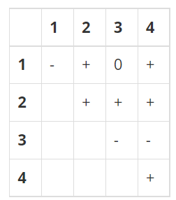

## 백준 1248 Guess
[문제 링크](https://www.acmicpc.net/problem/1248)

## 문제
Given a sequence of integers, a1, a2, …, an, we define its sign matrix S such that, for 1 ≤ i ≤ j ≤ n, Sij="+" if ai + … + aj > 0; Sij="−" if ai + … + aj < 0; and Sij="0" otherwise. 

For example, if (a1, a2, a3, a4)=( −1, 5, −4, 2), then its sign matrix S is a 4×4 matrix: 



We say that the sequence (−1, 5, −4, 2) generates the sign matrix. A sign matrix is valid if it can be generated by a sequence of integers. 

Given a sequence of integers, it is easy to compute its sign matrix. This problem is about the opposite direction: Given a valid sign matrix, find a sequence of integers that generates the sign matrix. Note that two or more different sequences of integers can generate the same sign matrix. For example, the sequence (−2, 5, −3, 1) generates the same sign matrix as the sequence (−1,5, −4,2). 

Write a program that, given a valid sign matrix, can find a sequence of integers that generates the sign matrix. You may assume that every integer in a sequence is between −10 and 10, both inclusive. 

## 핵심 포인트
```
- 백트래킹의 기본 원리를 응용하여 배열에 추가할 값과 확인해야 할 부분을 구현하자.
- 값이 하나씩 추가되면 어떤 부호를 확인해야 하는지 파악하고, 그에 맞추어 is_possible 함수를 구현한다.
- 대각선에 위치한 sign 배열을 통해 해당 인덱스의 값 부호를 확인한다.(음수, 0, 양수)
- is_possible 함수를 통해 정수 배열은 부호 배열의 값을 모두 만족하는지 검사한다.
```

## 핵심 코드
```
# 정수 배열 값이 모두 부호를 만족하는지 검사
# 정수 배열의 누적값과 부호 배열의 값이 일치하는지 확인
def is_possible(count):
    total = 0
    for i in range(count, -1, -1):
        total += result[i]
        if total > 0 and sign[i][idx] <= 0:
            return False
        elif total == 0 and sign[i][idx] != 0:
            return False
        elif total < 0 and sign[i][idx] >= 0:
            return False
    return True

def back_tracking(count):
    # 조건을 만족하는 숫자 배열 하나만 출력하면 되므로
    # 모든 조건을 만족하는 숫자 배열을 출력하고 바로 정상 종료
    if count == n:
        print(' '.join(map(str, result)))
        exit(0)

    # 범위는 -10에서 10까지이고 해당 부호는 count 값으로 알 수 있으므로 범위와 부호를 모두 고려한 real_i를 배열에 삽입
    for i in range(1, 11):
        real_i = sign[count][count] * i
        result.append(real_i)
        # 현재 인덱스까지 모든 부호 조건을 만족하면 count 증가
        if is_possible(count):
            back_tracking(count + 1)
        # 아닐 경우는 정수 배열의 값 pop
        result.pop()

```
