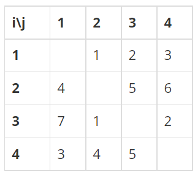

## 백준 15661 링크와 스타트
[문제 링크](https://www.acmicpc.net/problem/15661)

## 문제
오늘은 스타트링크에 다니는 사람들이 모여서 축구를 해보려고 한다. 축구는 평일 오후에 하고 의무 참석도 아니다. 축구를 하기 위해 모인 사람은 총 N명이다. 이제 스타트 팀과 링크 팀으로 사람들을 나눠야 한다. 두 팀의 인원수는 같지 않아도 되지만, 한 명 이상이어야 한다.

BOJ를 운영하는 회사 답게 사람에게 번호를 1부터 N까지로 배정했고, 아래와 같은 능력치를 조사했다. 능력치 Sij는 i번 사람과 j번 사람이 같은 팀에 속했을 때, 팀에 더해지는 능력치이다. 팀의 능력치는 팀에 속한 모든 쌍의 능력치 Sij의 합이다. Sij는 Sji와 다를 수도 있으며, i번 사람과 j번 사람이 같은 팀에 속했을 때, 팀에 더해지는 능력치는 Sij와 Sji이다.

N=4이고, S가 아래와 같은 경우를 살펴보자.
  

예를 들어, 1, 2번이 스타트 팀, 3, 4번이 링크 팀에 속한 경우에 두 팀의 능력치는 아래와 같다.

스타트 팀: S12 + S21 = 1 + 4 = 5
링크 팀: S34 + S43 = 2 + 5 = 7
1, 3번이 스타트 팀, 2, 4번이 링크 팀에 속하면, 두 팀의 능력치는 아래와 같다.

스타트 팀: S13 + S31 = 2 + 7 = 9
링크 팀: S24 + S42 = 6 + 4 = 10
축구를 재미있게 하기 위해서 스타트 팀의 능력치와 링크 팀의 능력치의 차이를 최소로 하려고 한다. 위의 예제와 같은 경우에는 1, 4번이 스타트 팀, 2, 3번 팀이 링크 팀에 속하면 스타트 팀의 능력치는 6, 링크 팀의 능력치는 6이 되어서 차이가 0이 되고 이 값이 최소이다.

## 핵심 포인트
```
- 백트래킹을 활용하여 두 그룹으로 나눌 수 있는 경우를 모두 구한다. (visited 배열을 활용하여 방문한 경우 T, 아닌 경우를 F로 두어 두 그룹으로 분리한다.)
- 두 그룹으로 잘 나누어진 경우, 모든 쌍을 방문하면서 같은 그룹에 있는지 비교하고 start나 link에 능력치를 더한다. (중복을 배제하고 모든 쌍을 구하기 위해 반복문의 시작과 끝을 조정한다.)
```

## 핵심 코드
```
# 각 팀의 능력치를 구하는 함수
def cal_score():
    global min_val
    start, link = 0, 0

    # 한 쌍을 비교해야 하므로 n-1번 반복
    for i in range(n - 1):
        # 중복을 방지하기 위해 i 이후부터 탐색 시작
        for j in range(i + 1, n):
            # 둘 다 스타트팀에 속할 때
            if visited[i] and visited[j]:
                start += s[i][j] + s[j][i]
            # 둘 다 링크팀에 속할 때
            elif not visited[i] and not visited[j]:
                link += s[i][j] + s[j][i]

    # 모든 경우의 수 중 두 팀의 능력치 차이가 가장 작은 값을 저장
    min_val = min(min_val, abs(start - link))

# N개의 수가 있을 때 두 그룹으로 나눌 수 있는 모든 경우를 구하는 방법
def back_tracking(number):
    # 모든 수의 그룹을 다 정했을 때 능력치 계산
    if number == n:
        cal_score()
        return

    visited[number] = True
    back_tracking(number + 1)
    visited[number] = False
    back_tracking(number + 1)
```
