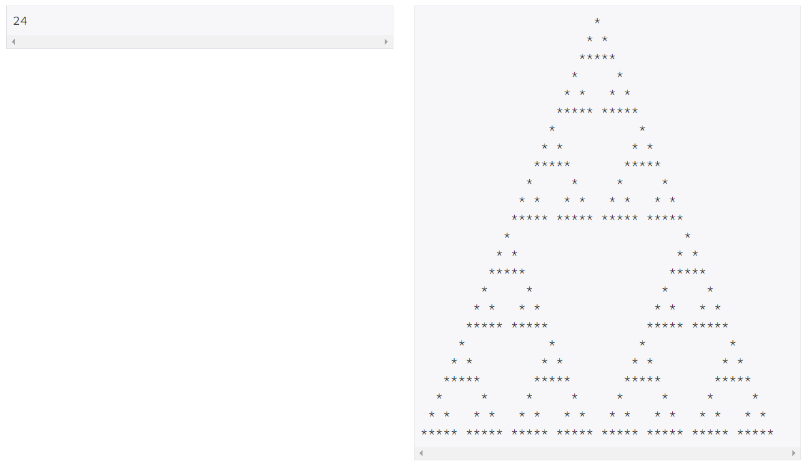

## 백준 2448 별 찍기 - 11
[문제 링크](https://www.acmicpc.net/problem/2448)

## 문제
예제를 보고 규칙을 유추한 뒤에 별을 찍어 보세요. N은 항상 3 * (2 ** k)이다.


## 핵심 포인트
```
- 분할 정복을 적용할 수 있는 가장 작은 단위를 생각한다.
- 이 문제에서는 n = 3일 때 기본 삼각형이 되고, n의 값이 증가할 때마다 직전 크기(n // 2) 삼각형이 세 개가 만들어진다.
- 입력으로 주어지는 n의 값을 파악하는 것도 중요하다.
- 빈 값을 넣을 때는 ' '을 넣어 초기화시킨다.
```

## 핵심 코드
```
def divide_star(i, j, size):
    if size == 3:
        stars[i][j] = '*'
        stars[i + 1][j - 1] = stars[i + 1][j + 1] = '*'
        for k in range(-2, 3):
            stars[i + 2][j + k] = '*'

    else:
        new_size = size // 2
        divide_star(i, j, new_size)
        divide_star(i + new_size, j - new_size, new_size)
        divide_star(i + new_size, j + new_size, new_size)
```
