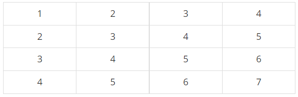

## 백준 11660 구간 합 구하기 5
[문제 링크](https://www.acmicpc.net/problem/11660)

## 문제
N×N개의 수가 N×N 크기의 표에 채워져 있다. (x1, y1)부터 (x2, y2)까지 합을 구하는 프로그램을 작성하시오. (x, y)는 x행 y열을 의미한다.

예를 들어, N = 4이고, 표가 아래와 같이 채워져 있는 경우를 살펴보자.



여기서 (2, 2)부터 (3, 4)까지 합을 구하면 3+4+5+4+5+6 = 27이고, (4, 4)부터 (4, 4)까지 합을 구하면 7이다.

표에 채워져 있는 수와 합을 구하는 연산이 주어졌을 때, 이를 처리하는 프로그램을 작성하시오.

## 핵심 포인트
```
- 2차원일 때 구간합 계산 방법을 생각한다. (전체 행에 대해서 열 값 누적합, 전체 열에 대해서 행 값 누적합)
- 구간 합과 구하고자 하는 값 사이의 규칙에 대해서 정의한다.
- 규칙을 구한 결과, x1과 y1이 1씩 감소된 인덱스에 접근해야 하므로 행과 열이 0인 인덱스를 초기화할 필요가 있다. 
```

## 핵심 코드
```
# 구간 합 계산
for i in range(1, n + 1):
    for j in range(1, n):
        matrix[i][j + 1] += matrix[i][j]

for i in range(1, n):
    for j in range(1, n + 1):
        matrix[i + 1][j] += matrix[i][j]
    
for _ in range(m):
    x1, y1, x2, y2 = map(int, input().split())
    print(matrix[x2][y2] - matrix[x1 - 1][y2] - matrix[x2][y1 - 1] + matrix[x1 - 1][y1 - 1])
```
