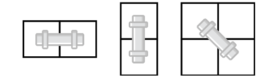
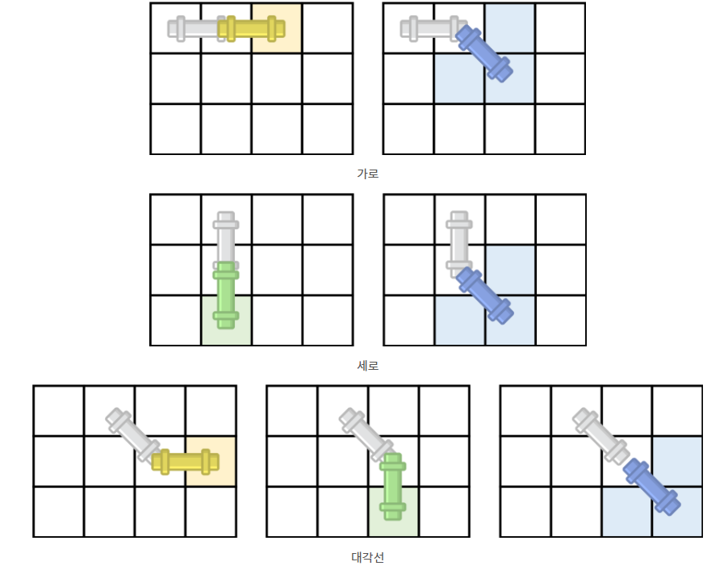

## 백준 17070 파이프 옮기기 1
[문제 링크](https://www.acmicpc.net/problem/17070)

## 문제
유현이가 새 집으로 이사했다. 새 집의 크기는 N×N의 격자판으로 나타낼 수 있고, 1×1크기의 정사각형 칸으로 나누어져 있다. 각각의 칸은 (r, c)로 나타낼 수 있다. 여기서 r은 행의 번호, c는 열의 번호이고, 행과 열의 번호는 1부터 시작한다. 각각의 칸은 빈 칸이거나 벽이다.

오늘은 집 수리를 위해서 파이프 하나를 옮기려고 한다. 파이프는 아래와 같은 형태이고, 2개의 연속된 칸을 차지하는 크기이다.

  
파이프는 회전시킬 수 있으며, 아래와 같이 3가지 방향이 가능하다.



파이프는 매우 무겁기 때문에, 유현이는 파이프를 밀어서 이동시키려고 한다. 벽에는 새로운 벽지를 발랐기 때문에, 파이프가 벽을 긁으면 안 된다. 즉, 파이프는 항상 빈 칸만 차지해야 한다.

파이프를 밀 수 있는 방향은 총 3가지가 있으며, →, ↘, ↓ 방향이다. 파이프는 밀면서 회전시킬 수 있다. 회전은 45도만 회전시킬 수 있으며, 미는 방향은 오른쪽, 아래, 또는 오른쪽 아래 대각선 방향이어야 한다.

파이프가 가로로 놓여진 경우에 가능한 이동 방법은 총 2가지, 세로로 놓여진 경우에는 2가지, 대각선 방향으로 놓여진 경우에는 3가지가 있다.

아래 그림은 파이프가 놓여진 방향에 따라서 이동할 수 있는 방법을 모두 나타낸 것이고, 꼭 빈 칸이어야 하는 곳은 색으로 표시되어져 있다.



가장 처음에 파이프는 (1, 1)와 (1, 2)를 차지하고 있고, 방향은 가로이다. 파이프의 한쪽 끝을 (N, N)로 이동시키는 방법의 개수를 구해보자.

## 핵심 포인트
```
- BFS를 사용하여 코드를 구현할 경우 시간 초과 발생
- 완전 탐색을 할 경우는 DFS를 이용하는 것이 더 빠르다.
- 수평과 수직으로 움직일 경우는 x, y 좌표 중 하나만 확인하면 되지만, 대각선의 경우는 세 위치가 모두 벽이 아닌지 확인해야 한다.
```

## 핵심 코드
```
def dfs(x, y, dir):
    global count
    if x == n - 1 and y == n - 1:
        count += 1

    if dir == hor or dir == dig:
        if 0 <= (y + 1) < n and not pipe[x][y + 1]:
            dfs(x, y + 1, hor)

    if dir == ver or dir == dig:
        if 0 <= (x + 1) < n and not pipe[x + 1][y]:
            dfs(x + 1, y, ver)

    if 0 <= (x + 1) < n and 0 <= (y + 1) < n:
        if not pipe[x + 1][y] and not pipe[x + 1][y + 1] and not pipe[x][y + 1]:
            dfs(x + 1, y + 1, dig)
```