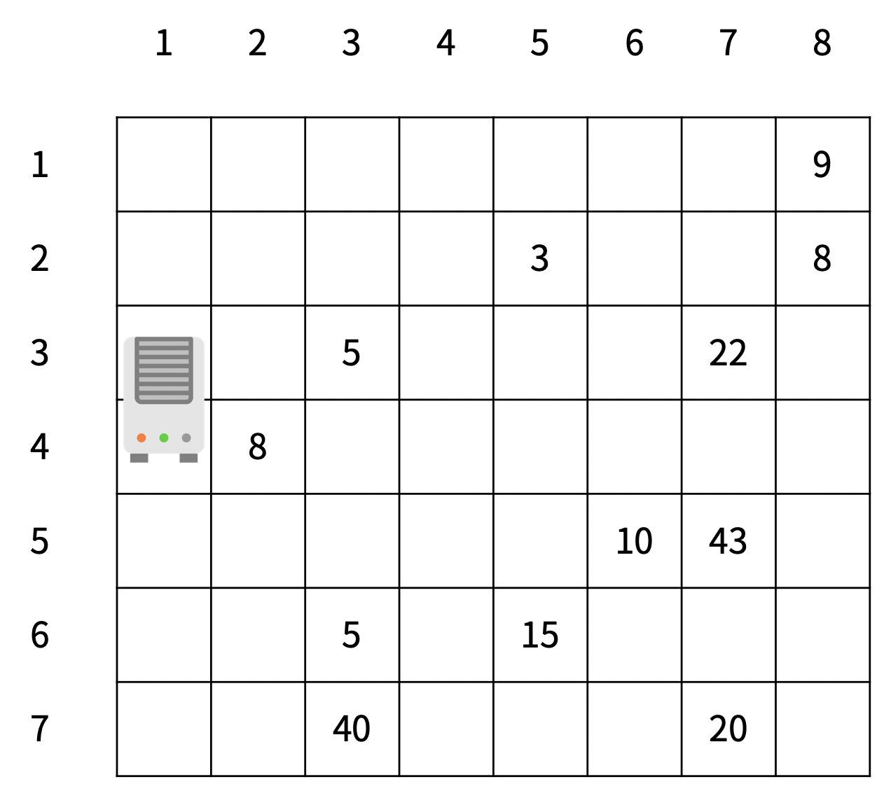
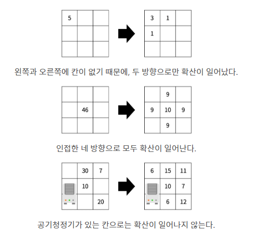
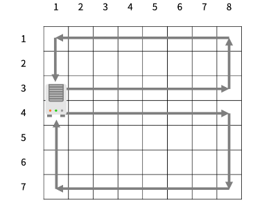

## 백준 17144 미세먼지 안녕!
[문제 링크](https://www.acmicpc.net/problem/17144)

## 문제
미세먼지를 제거하기 위해 구사과는 공기청정기를 설치하려고 한다. 공기청정기의 성능을 테스트하기 위해 구사과는 집을 크기가 R×C인 격자판으로 나타냈고, 1×1 크기의 칸으로 나눴다. 구사과는 뛰어난 코딩 실력을 이용해 각 칸 (r, c)에 있는 미세먼지의 양을 실시간으로 모니터링하는 시스템을 개발했다. (r, c)는 r행 c열을 의미한다.



공기청정기는 항상 1번 열에 설치되어 있고, 크기는 두 행을 차지한다. 공기청정기가 설치되어 있지 않은 칸에는 미세먼지가 있고, (r, c)에 있는 미세먼지의 양은 Ar,c이다.

1초 동안 아래 적힌 일이 순서대로 일어난다.

미세먼지가 확산된다. 확산은 미세먼지가 있는 모든 칸에서 동시에 일어난다.
(r, c)에 있는 미세먼지는 인접한 네 방향으로 확산된다.
인접한 방향에 공기청정기가 있거나, 칸이 없으면 그 방향으로는 확산이 일어나지 않는다.
확산되는 양은 Ar,c/5이고 소수점은 버린다.
(r, c)에 남은 미세먼지의 양은 Ar,c - (Ar,c/5)×(확산된 방향의 개수) 이다.
공기청정기가 작동한다.
공기청정기에서는 바람이 나온다.
위쪽 공기청정기의 바람은 반시계방향으로 순환하고, 아래쪽 공기청정기의 바람은 시계방향으로 순환한다.
바람이 불면 미세먼지가 바람의 방향대로 모두 한 칸씩 이동한다.
공기청정기에서 부는 바람은 미세먼지가 없는 바람이고, 공기청정기로 들어간 미세먼지는 모두 정화된다.
다음은 확산의 예시이다.


공기청정기의 바람은 다음과 같은 방향으로 순환한다.   



방의 정보가 주어졌을 때, T초가 지난 후 구사과의 방에 남아있는 미세먼지의 양을 구해보자.

## 핵심 포인트
```
- 미세먼지 확산은 현재 값을 기준으로 확산 양을 계산해야 하므로 크기가 같은 배열을 하나 더 생성해야 한다.
- 네 방향 중 이동이 가능한 방향으로 5를 나눈 값을 확산시키고 현재 칸에서는 남은 미세먼지의 값만 저장한다.
- 위로 공기청정기가 순환하는 것은 (오른쪽, 위, 왼쪽, 아래) 순으로 진행해야 한다. 처음으로 값이 바뀌는 부분은 up, 1이다.
- 아래로 공기청정기가 순환하는 것은 (오른쪽, 아래, 왼쪽 위) 순으로 진행해야 한다. 처음으로 값이 바뀌는 부분은 down, 1이다.
```

## 핵심 코드
```
# 미세먼지 확산
def dust_spread():
    dx = [-1, 1, 0, 0]
    dy = [0, 0, -1, 1]
    # 확산 양을 저장하기 위한 배열 생성
    temp = [[0] * c for _ in range(r)]

    for x in range(r):
        for y in range(c):
            if board[x][y] != 0 and board[x][y] != -1:
                # 확산된 미세먼지 양
                spread_out = 0

                for i in range(4):
                    nx = x + dx[i]
                    ny = y + dy[i]

                    if 0 <= nx < r and 0 <= ny < c and board[nx][ny] != -1:
                        # 확산된 미세먼지 양 저장
                        temp[nx][ny] += board[x][y] // 5
                        spread_out += board[x][y] // 5

                # 남은 미세먼지 양 표시
                board[x][y] -= spread_out

    for i in range(r):
        for j in range(c):
            # 남은 미세먼지 양과 확산된 미세먼지 양의 합
            board[i][j] += temp[i][j]


# 공기청정기 순환(위쪽)
def up_circle():
    # 회전 방향(우, 상, 좌, 하)
    dx = [0, -1, 0, 1]
    dy = [1, 0, -1, 0]

    dir, temp = 0, 0
    # 처음으로 값이 바뀌는 좌표
    x, y = up, 1

    while True:
        nx = x + dx[dir]
        ny = y + dy[dir]

        # 공기청정기 위치일 때 반복 중단
        if x == up and y == 0:
            break

        # 범위를 벗어나면 방향 전환
        if 0 > nx or nx >= r or 0 > ny or ny >= c:
            dir += 1
            continue

        # 이전 값을 사용하여 미세먼지 양 업데이트
        board[x][y], temp = temp, board[x][y]
        x = nx
        y = ny

# 공기청정기 순환(아래쪽)
def down_circle():

    # 회전 방향(우, 하, 좌, 상)
    dx = [0, 1, 0, -1]
    dy = [1, 0, -1, 0]

    dir, temp = 0, 0
    # 처음으로 값이 바뀌는 좌표
    x, y = down, 1

    while True:
        nx = x + dx[dir]
        ny = y + dy[dir]

        if x == down and y == 0:
            break

        if 0 > nx or nx >= r or 0 > ny or ny >= c:
            dir += 1
            continue

        board[x][y], temp = temp, board[x][y]
        x = nx
        y = ny
```
