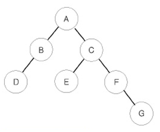

## 백준 1991 트리 순회
[문제 링크](https://www.acmicpc.net/problem/1991)

## 문제
이진 트리를 입력받아 전위 순회(preorder traversal), 중위 순회(inorder traversal), 후위 순회(postorder traversal)한 결과를 출력하는 프로그램을 작성하시오.



예를 들어 위와 같은 이진 트리가 입력되면,

전위 순회한 결과 : ABDCEFG // (루트) (왼쪽 자식) (오른쪽 자식)
중위 순회한 결과 : DBAECFG // (왼쪽 자식) (루트) (오른쪽 자식)
후위 순회한 결과 : DBEGFCA // (왼쪽 자식) (오른쪽 자식) (루트)

## 핵심 포인트
```
- 트리가 알파벳으로 구성된 경우, 서브 트리에 접근하기 위해서 딕셔너리로 트리 구성
- 루트가 '.'가 되면 트리 순회 중단
```

## 핵심 코드
```
def preorder(root):
    if root != '.':
        print(root)
        preorder(tree[root][0])
        preorder(tree[root][1])

def inorder(root):
    if root != '.':
        inorder(tree[root][0])
        print(root)
        inorder(tree[root][1])

def postorder(root):
    if root != '.':
        postorder(tree[root][0])
        postorder(tree[root][1])
        print(root)
```
