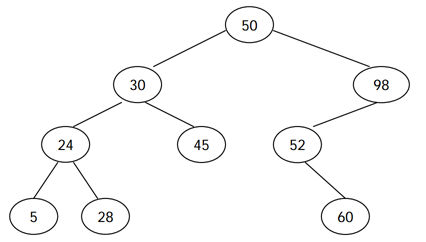

## 백준 5639 이진 탐색 트리
[문제 링크](https://www.acmicpc.net/problem/5639)

## 문제
이진 검색 트리는 다음과 같은 세 가지 조건을 만족하는 이진 트리이다.

노드의 왼쪽 서브트리에 있는 모든 노드의 키는 노드의 키보다 작다.
노드의 오른쪽 서브트리에 있는 모든 노드의 키는 노드의 키보다 크다.
왼쪽, 오른쪽 서브트리도 이진 검색 트리이다.


전위 순회 (루트-왼쪽-오른쪽)은 루트를 방문하고, 왼쪽 서브트리, 오른쪽 서브 트리를 순서대로 방문하면서 노드의 키를 출력한다. 후위 순회 (왼쪽-오른쪽-루트)는 왼쪽 서브트리, 오른쪽 서브트리, 루트 노드 순서대로 키를 출력한다. 예를 들어, 위의 이진 검색 트리의 전위 순회 결과는 50 30 24 5 28 45 98 52 60 이고, 후위 순회 결과는 5 28 24 45 30 60 52 98 50 이다.

이진 검색 트리를 전위 순회한 결과가 주어졌을 때, 이 트리를 후위 순회한 결과를 구하는 프로그램을 작성하시오.

## 핵심 포인트
```
- 입력 횟수가 주어지지 않을 때는 try-except 구문을 이용해서 사용자가 원하는 만큼 입력받는다.
- preorder 출력값을 바탕으로 root, left, right를 구분한다.
- 재귀를 이용하려면 recursionlimit를 새로 정의하여 반복 횟수를 늘린다.
```

## 핵심 코드
```
def postorder(start, end):
    if start > end:
        return

    # 왼쪽 서브트리만 있는 경우
    mid = end + 1

    for i in range(start + 1, end + 1):
        # 루트의 값보다 큰 값이 있을 경우
        # 오른쪽 서브트리로 구분
        if preorder[start] < preorder[i]:
            mid = i
            break

    # 후위 순회이므로 왼쪽, 오른쪽, 루트 순으로 출력
    postorder(start + 1, mid - 1)
    postorder(mid, end)
    print(preorder[start])
```
